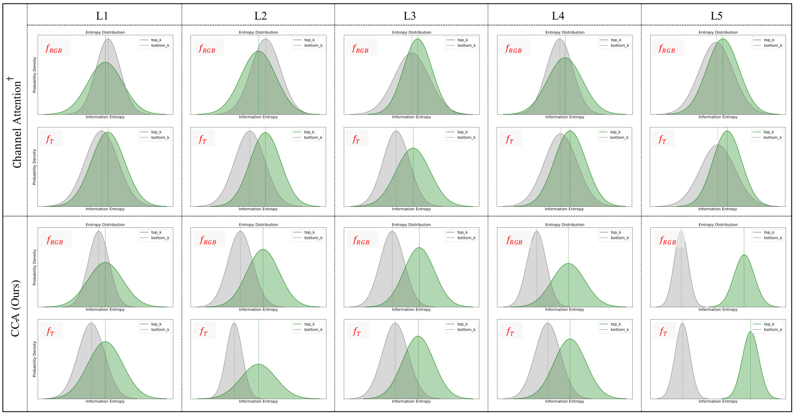
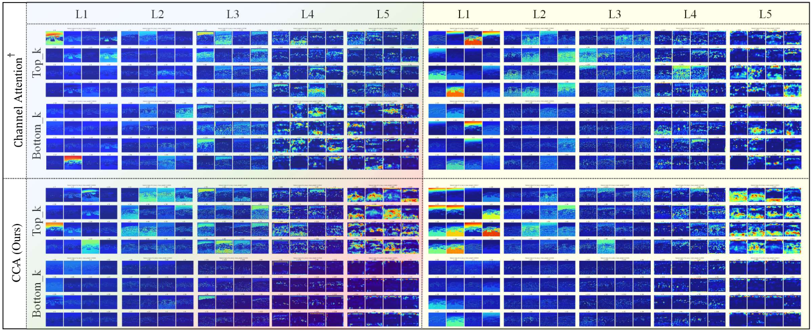

## Rethinking Self-Attention for Multispectral Object Detection.

### <center> The code will be released after the paper is accepted. </center>

---

### Description:
Data from different modalities, such as infrared and visible light images, can offer complementary information, and integrating such information can significantly enhance the perceptual capabilities of a system to the surroundings. Thus, multi-modal object detection has widespread applications, particularly in challenging weather conditions like low-light scenarios. The core of multi-modal fusion lies in developing a reasonable fusion strategy, which can fully exploit the complementary features of different modalities while preventing a significant increase in model complexity. To this end, this chapter proposes a novel lightweight cross-fusion module named Channel-Patch Cross Fusion (CPCF), which leverages Channel-wise Cross-Attention (CCA) and Patch-wise Cross-Attention (PCA) to encourage mutual rectification among different modalities. This process simultaneously explores commonalities across modalities while maintaining the uniqueness of each modality. Furthermore, we design a versatile intermediate fusion framework that can leverage CPCF to enhance the performance of multi-modal object detection. The proposed method is extensively evaluated on multiple public multi-modal datasets, namely FLIR, LLVIP, and DroneVehicle. The experiments indicate that our method yields consistent performance gains across various benchmarks and can be extended to different types of detectors, further demonstrating its robustness and generalizability.

- Comparison of the **unimodal (left)** and **multimodal (right)** detection results on FLIR dataset. >**RGB**<
<div align="center">

</div>

- Comparison of the **unimodal (left)** and **multimodal (right)** detection results on FLIR dataset. >**Thernal**<
<div align="center">

</div>

- Comparison of the **unimodal (left)** and **multimodal (right)** detection results on DroneVehicle dataset. >**RGB**<
<div align="center">

</div>

- Comparison of the **unimodal (left)** and **multimodal (right)** detection results on DroneVehicle dataset. >**Thermal**<
<div align="center">

</div>

- Comparison of information entropy distributions of top and bottom 16 channels of RGB and Thermal feature maps at different levels. † denotes MLP-based cross-attention.

<div align='center'>

</div>

- Visualization of top k and bottom k channel features.The left side shows the RGB data stream at different stages, while the right side shows the counterpart of the thermal data stream. † denotes MLP-based cross-attention.

<div align='center'>

</div>

-----------------------------------------------------------------------------------------------------------------

## Setup Environment
For this project, we used python 3.8.16. Pytorch 1.13.1 and all experiments were executed on a NVIDIA RTX 3090.

We recommend setting up a new virtual environment:

 ```bash
 conda create -n CPCF python=3.8.16
 conda install pytorch==1.13.1 torchvision==0.14.1 pytorch-cuda=11.7 -c pytorch -c nvidia
 ```

 In that environment, you should config the mmdetection related packages:

 ```bash
 pip install -U openmim
 mim install mmengine
 mim install "mmcv==2.0.1"
```

Then, the required packages for this project can be installed by running:

```bash
 pip install -r requirements.txt
```

-----------------------------------------------------------------------------------------------------------------
## Setup Datasets
__Aligned FLIR dataset__ can be downloaded from [Google Drive](https://drive.google.com/file/d/1y4M7CdX79mudMWLpfPAmacVOVFbHNkAC/view?usp=drive_link) 

After downloading the dataset, you shoud convert the dataset to COCO format by running the following command:

```bash
python tools/dataset_converters/FLIR2coco.py
```

__LLVIP dataset__ can be obtained from this [repo](https://github.com/bupt-ai-cz/LLVIP)

After downloading the dataset, you shoud convert the dataset to COCO format by running the following command:

```bash
python tools/dataset_converters/LLVIP2coco.py
```

__DroneVehicle dataset__ can be obtained from this [repo](https://github.com/SunYM2020/UA-CMDet#dronevehicle-dataset) (You should also download the coco format annotations)

Images in DroneVehicle dataset are paded on four sides, so you should crop the images by running the following command:

```bash
python tools/dataset_converters/DroneVehicle/crop_images.py
``` 

__KAIST dataset__ can be obtained from official [website](https://soonminhwang.github.io/rgbt-ped-detection/) or directly download our converted dataset from [Google Drive]().

__Note:__ To evaluate the performance of the model on the KAIST dataset, you should clone the [MLPD-Multi-Label-Pedestrian-Detection](https://github.com/sejong-rcv/MLPD-Multi-Label-Pedestrian-Detection). This repo is used to evaluate the performance of the model on the KAIST dataset.

To do so:
1. config the val_evaluator in the config file as follows:
```python
val_evaluator = dict(
      type='CocoMetric',
      ann_file=data_root + 'annotations/KAIST_test_visible.json',
      metric='bbox',
      format_only=False,   # <=== set this to False to generate the results file
      outfile_prefix='/home/sijie/Documents/mmdet-cpcf/multimodal-mmdet/work_dirs/kaist_yolox',   # <=== set the prefix of the results file
      )
```
2. run the test.py to generate the json results file
```bash
python tools/test.py [config] [checkpoint]
```
3. convert the results file to the kaist format for evaluation (a new json file will be generated in the same folder as the results file)
```bash
python tools/dataset_converters/mmrst2kaistrst.py [results_file]
```
4. evaluate the performance
```bash
cd .../MLPD-Multi-Label-Pedestrian-Detection
python evaluation_script/evaluation_script.py --rstFiles [new_results_file]
```

### Dataset Structure
The final folder structure should look like this:

```
repo
├── ...
├── data
│   ├── align (FLIR dataset)
│   │   ├── annotations
│   │   ├── JPEGImages
│   │   ├── ...
│   ├── LLVIP
│   │   ├── annotations
│   │   ├── infrared
│   │   ├── visible
│   │   ├── ...
│   ├── DroneVehicle
│   │   ├── annotations
│   │   ├── train
│   │   ├── val
│   │   ├── test
│   │   ├── ...
│   ├── kaist
│   │   ├── annotations
│   │   ├── infrared
│   │   ├── visible
│   │   ├── ...
│   ├── ...
├── ...
```
-----------------------------------------------------------------------------------------------------------------

## Training
```bash
python tools/train.py ${CONFIG_FILE}
```

## Testing
To reproduce the results on FLIR dataset, you can download the pre-trained models from [Google Drive](https://drive.google.com/file/d/1DilatfayXrpMGPW7bi9SBjHh1SPA_phH/view?usp=sharing) and put them in the `work_dirs` folder. Then, you can run the following command to test the model:

```bash
python tools/test.py configs/yolox/yolox_s_8xb8_FLIR_cross.py work_dirs/best_checkpoint.pth 
```

To reproduce the results on LLVIP dataset, you can download the pre-trained models from [Google Drive](https://drive.google.com/file/d/1hL0Idw-vBNpElATos4DX0vTSg3OCVA8M/view?usp=sharing) and put them in the `work_dirs` folder. Then, you can run the following command to test the model:

```bash
python tools/test.py configs/yolox/yolox_s_8xb8_LLVIP_cross.py work_dirs/best_checkpoint.pth 
```

## Acknowledgement

We acknowledge [MMDetection](https://github.com/open-mmlab/mmdetection) and [MMRotation](https://github.com/open-mmlab/mmrotate) for their open-source codebase that allowed us to implement our method quickly.

## Citation

If you find this project useful in your research, please consider cite:

```latex
Comming soon
```

## License

This project is released under the [Apache 2.0 license](LICENSE).


